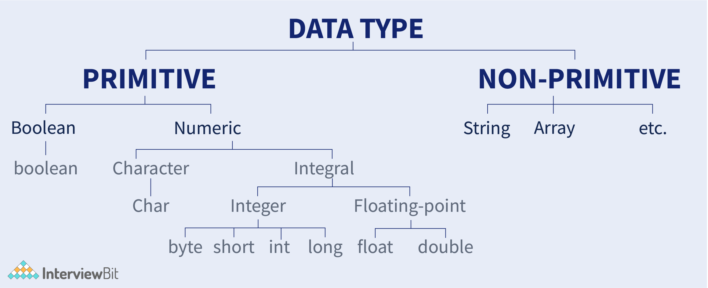

# Basics before we dive into Data Structure and Algorithms 

### Java CheatSheet
This link will cover basics like data types, variables, loops, if-else, etc. in very detail

**https://www.interviewbit.com/java-cheat-sheet/**

### Data Types

### Time Complexity & Space Complexity

Asymptotic notations are mathematical tools to represent the time complexity of algorithms or runtime-performance.

There are mainly three asymptotic notations:
1) **Big-O Notation** (O-notation)
Big-O notation represents the upper bound of the running time of an algorithm. Therefore, it gives the worst-case complexity of an algorithm.

2) **Omega Notation** (Ω-notation)
Omega notation represents the lower bound of the running time of an algorithm. Thus, it provides the best case complexity of an algorithm.

3) **Theta Notation** (Θ-notation)
Theta notation encloses the function from above and below. Since it represents the upper and the lower bound of the running time of an algorithm, it is used for analyzing the average-case complexity of an algorithm.  

Mostly we use Big-O Notation,
Big O notation is a mathematical notation that describes the limiting behavior of a function when the argument tends towards a particular value or infinity. In simple words, it tells us how much runtime complexity will increase with respect to the increase in size of input
Few points to keep in mind while calculating Big-O Notation:
1)  **Different steps get added** : 
    There are two input arrays - (a,b);
    Step 1: Iterate over array 'a'
    Step 2: Iterate over array 'b'
    So, Time Complexity = O(a + b)
2)  **Drop constants** :
    If there are some calculation that will require constant time and does not depend on the size of input, 
    then we drop those constant in our time complexity
    e.g: There is a calculation that takes '1' unit of time and after that
    we do calculation on complete array of size 'n'.
    So, Time Complexity : O(1 + n) will be written as O(n)
3)  **Drop non dominate terms** : 
    If there are multiple operation happening with the input then we only consider operation that will 
    take the most unit of time
    e.g: We iterate on array of 'n' size and then we have a loop inside a loop(nested loop), in which both runs till n.
    So, Time Complexity = O(n + N ^ 2) which will become O(n ^ 2);

List of some common asymptotic notations − ('n' is the size of input)
1) constant	− Ο(1)
2) logarithmic − Ο(log n)
3) linear −	Ο(n)
4) n log n − Ο(n log n)
5) quadratic − Ο(n^2)
6) cubic − Ο(n^3)
7) polynomial − n^Ο(1)
8) exponential − 2^Ο(n)

Space complexity is similar to time complexity. 

The term Space Complexity is misused for Auxiliary Space at many places. 
Following are the correct definitions of Auxiliary Space and Space Complexity. 

**Auxiliary Space** is the extra space or temporary space used by an algorithm.

**Space Complexity** of an algorithm is the total space taken by the algorithm with respect to the input size. Space complexity includes both Auxiliary space and space used by input. 

